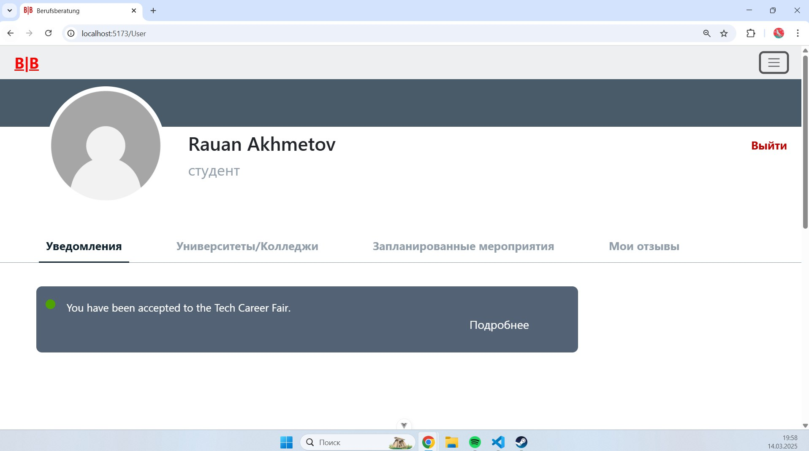
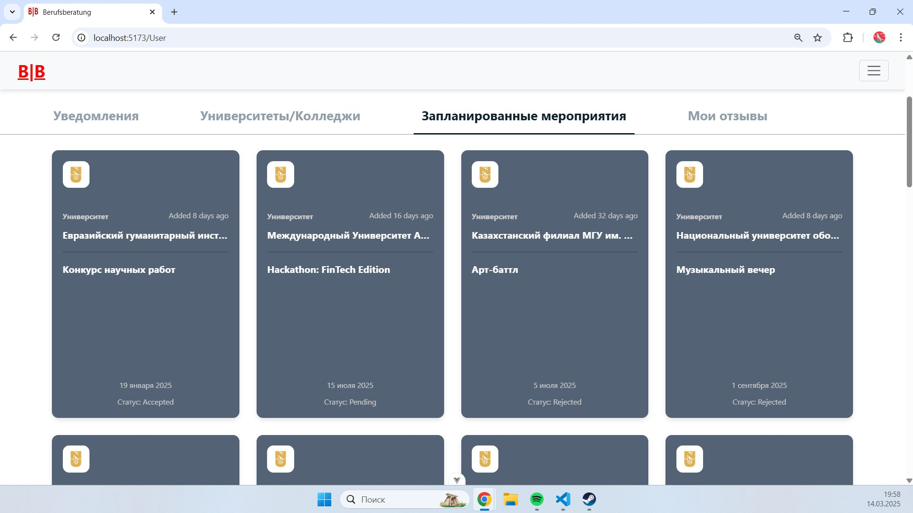
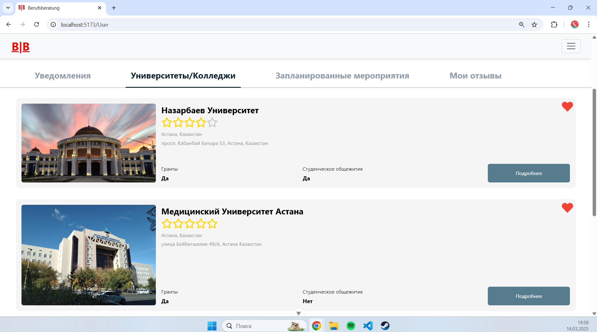
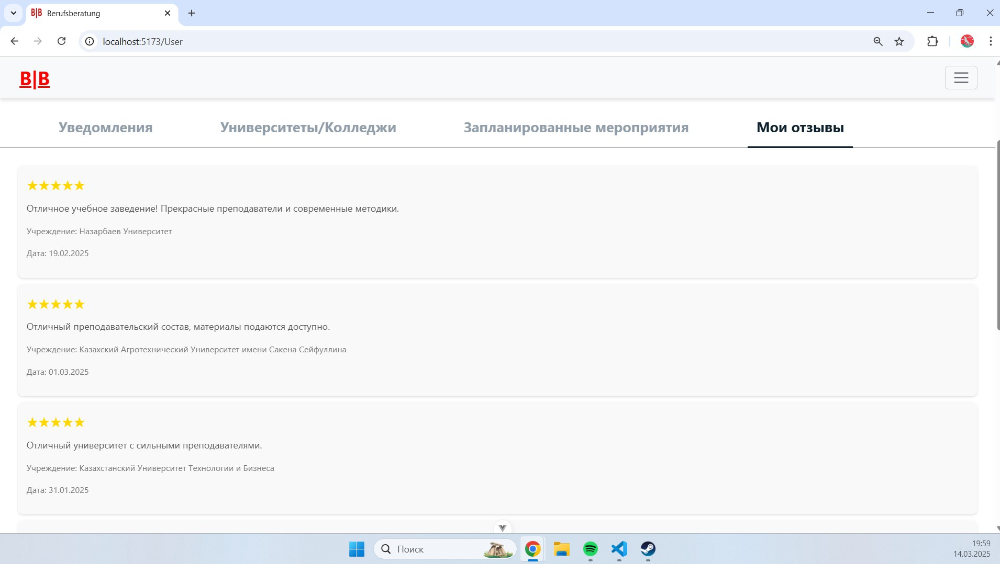
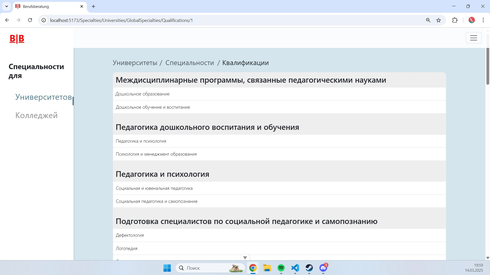
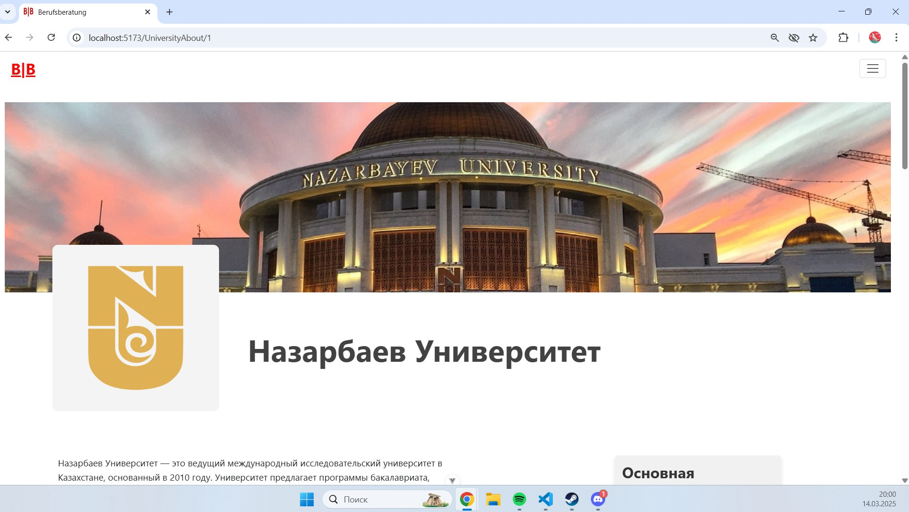
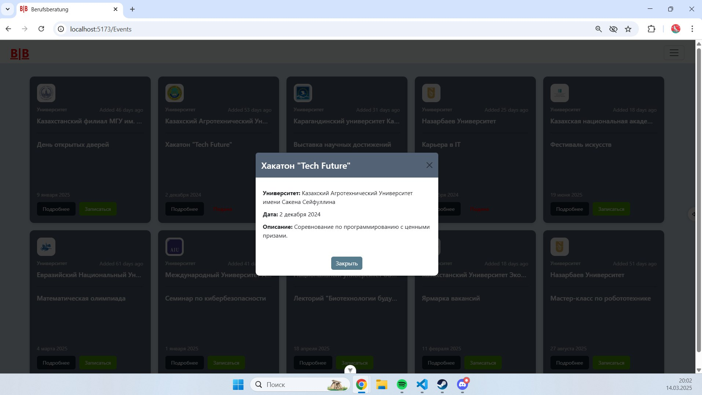

# Berufsberatung (B/B)

## Описание проекта

### Постановочная часть

#### Формулировка задачи
В условиях цифровизации и увеличения числа образовательных учреждений абитуриенты сталкиваются со сложным выбором учебного заведения и специальности. Отсутствие централизованной информации, удобных инструментов для сравнения и экспертных рекомендаций усложняет процесс принятия решения. В связи с этим разработка веб-приложения "Berufsberatung" (B/B) становится актуальной задачей. Оно предоставляет централизованный доступ к информации о вузах и колледжах, их направлениях подготовки, условиях поступления и дополнительных возможностях (гранты, общежития, дистанционное обучение и т.д.).

**Цель проекта** — создание многофункциональной платформы, которая поможет пользователям:
- Найти подходящее учебное заведение с учетом заданных параметров.
- Ознакомиться с перечнем доступных специальностей.
- Получить информацию о мероприятиях, проводимых вузами и колледжами.
- Взаимодействовать с представителями учебных заведений через заявки и обратную связь.
- Изучить отзывы студентов и выпускников о качестве обучения.
- Сохранить избранные заведения и специальности в личном кабинете.

**Задачи разработки:**
1. Разработать структуру базы данных, включающую таблицы учебных заведений, специальностей, мероприятий и пользователей.
2. Реализовать систему фильтрации учебных заведений по ключевым параметрам.
3. Внедрить поиск специальностей по ключевым словам.
4. Обеспечить авторизацию пользователей и доступ к личному кабинету.
5. Создать интерфейс для представителей учебных заведений с возможностью добавления и редактирования информации.
6. Реализовать систему подачи заявок на участие в мероприятиях и обратной связи.
7. Создать рейтинг учебных заведений на основе отзывов и оценок пользователей.


#### Описание входных и выходных данных
**Входные данные:**
- Информация об учебных заведениях: название, тип (университет/колледж), год основания, адрес, контакты, наличие общежития, грантов.
- Данные о специальностях: название, описание, список вузов и колледжей, где они доступны.
- Данные о мероприятиях: название, дата, место проведения, описание, организатор.
- Данные пользователей: имя, email, пароль.
- Ключевые слова для поиска специальностей.
- Геолокационные данные для расчета маршрутов.
- Оценки и отзывы пользователей.
- История взаимодействий пользователя с системой.

**Выходные данные:**
- Списки учебных заведений с учетом фильтров.
- Детальная информация о заведении (описание, контакты, галерея, специальности, отзывы).
- Списки мероприятий с возможностью подачи заявки.
- Список подходящих специальностей по ключевым словам.
- Уведомления о статусе заявок.
- Рейтинговая система учебных заведений.
- Личный кабинет с избранными заведениями и специальностями.


---

## Технологии
- **Frontend**: Vue.js, Element Plus
- **Backend**: Laravel
- **База данных**: MySQL 
- **Инструменты**: Vite (для сборки фронтенда), npm

---

## Установка и запуск проекта

### Требования
- Node.js (версия 18.x или выше)
- npm (версия 9.x или выше)
- PHP (версия 8.x или выше)
- Composer (для установки зависимостей Laravel)
- MySQL (или другая СУБД, совместимая с Laravel)

### Инструкция по установке

#### 1. Клонирование репозитория
Склонируйте репозиторий проекта на ваш локальный компьютер:
```bash
git clone https://github.com/Rauan228/Berufsberatung-Vue.git
cd Berufsberatung-Vue
```

#### 2. Установка зависимостей фронтенда
Перейдите в корневую папку проекта и установите зависимости для Vue.js:
```bash
npm install
```

#### 3. Настройка серверной части (Laravel)
Cерверная часть находится в отдельной папке (например, `backend`). Если она включена в проект, выполните:
1. Перейдите в папку серверной части:
   ```bash
   cd backend
   ```
2. Установите зависимости Laravel:
   ```bash
   composer install
   ```
3. Скопируйте файл конфигурации:
   ```bash
   cp .env.example .env
   ```
4. Настройте файл `.env` (укажите параметры базы данных, такие как `DB_DATABASE`, `DB_USERNAME`, `DB_PASSWORD`).
5. Сгенерируйте ключ приложения:
   ```bash
   php artisan key:generate
   ```
6. Выполните миграции базы данных и заполнением их данными:
   ```bash
   php artisan migrate --seed
   ```


#### 4. Запуск фронтенда
Из корневой папки проекта запустите разработческий сервер для Vue.js:
```bash
npm run dev
```
Фронтенд будет доступен по адресу `http://localhost:5173` (порт может отличаться, проверьте вывод в консоли).

#### 5. Запуск бэкенда
Из папки `backend` запустите сервер Laravel:
```bash
php artisan serve
```
Бэкенд будет доступен по адресу `http://localhost:8000`.

#### 6. Настройка связи фронтенда и бэкенда
Убедитесь, что в настройках фронтенда (например, в `vite.config.js` или в файле конфигурации API) указан правильный адрес бэкенда (по умолчанию `http://localhost:8000`).

---


## Скриншоты

### Главная страница


### Страница личного кабинета





### Страница специальностей университетов



### Страница списка университетов

.jpg)

### Страница подробностей университета

.jpg)
.jpg)
.jpg)
.jpg)

### Главная страница для представителей универа

.jpg)

### Страница мероприятий

.jpg)


## Структура проекта
```
Berufsberatung-Vue-main/
├── .vscode/                      # Настройки для VS Code
│   └── extensions.json           # Рекомендуемые расширения
├── IKONS/                        # Папка для иконок проекта
├── node_modules/                 # Зависимости Node.js (игнорируется в git)
├── public/                       # Публичные статические файлы
│   ├── B_B.png                   # Логотип проекта
│   └── favicon.ico               # Иконка сайта
├── src/                          # Исходный код приложения
│   ├── assets/                   # Статические ресурсы
│   │   ├── icons/                # Подпапка для иконок
│   │   ├── base.css              # Базовые стили
│   │   ├── heart-fill.png        # Иконка заполненного сердца
│   │   ├── heart-line.png        # Иконка контура сердца
│   │   ├── logo.svg              # SVG-логотип
│   │   └── main.css              # Основные стили приложения
│   ├── components/               # Компоненты Vue.js
│   │   ├── icons/                # Компоненты иконок
│   │   │   ├── .editorconfig     # Настройки форматирования для иконок
│   │   │   ├── B_B.png           # Логотип в компонентах
│   │   │   ├── heart-fill.png    # Иконка заполненного сердца
│   │   │   ├── heart-line.png    # Иконка контура сердца
│   │   │   ├── IconCommunity.vue # Компонент иконки сообщества
│   │   │   ├── IconDocumentation.vue # Компонент иконки документации
│   │   │   ├── IconEcosystem.vue # Компонент иконки экосистемы
│   │   │   ├── iconmonstr-heart-thin.svg # SVG-иконка сердца
│   │   │   ├── IconSupport.vue   # Компонент иконки поддержки
│   │   │   └── IconTooling.vue   # Компонент иконки инструментов
│   │   ├── img/                  # Папка для изображений (пустая или для будущих файлов)
│   │   ├── institutions/         # Компоненты для работы с учебными заведениями
│   │   │   ├── InctitutionsMain.vue # Главный компонент учреждений (возможно опечатка в имени)
│   │   │   ├── InstitutionApplications.vue # Заявки учреждений
│   │   │   ├── InstitutionData.vue # Данные учреждения
│   │   │   ├── InstitutionEvents.vue # Мероприятия учреждения
│   │   │   └── InstitutionSpecialties.vue # Специальности учреждения
│   │   ├── CollegesListPage.vue  # Страница списка колледжей
│   │   ├── EventApply.vue        # Компонент подачи заявки на мероприятие
│   │   ├── EventsPage.vue        # Страница мероприятий
│   │   ├── LoginForm.vue         # Форма входа
│   │   ├── LoginInstitution.vue  # Вход для представителей учреждений
│   │   ├── MainPage.vue          # Главная страница
│   │   ├── MapPage.vue           # Страница с картой
│   │   ├── RegisterInstitution.vue # Регистрация учреждения
│   │   ├── SpecialtiesColListPage.vue # Список специальностей колледжей
│   │   ├── SpecialtiesUnListPage.vue # Список специальностей университетов
│   │   ├── SUMListPage.vue       # Список (возможно, Summary или другое сокращение)
│   │   ├── TestPage.vue          # Тестовая страница
│   │   ├── UniversityAboutPage.vue # Страница "О университете"
│   │   ├── UniversityListPage.vue # Список университетов
│   │   ├── UniversityPortalPage.vue # Портал университета
│   │   └── UserPage.vue          # Страница пользователя
│   ├── services/                 # Сервисы для работы с API
│   │   └── authService.js        # Сервис авторизации
│   ├── store/                    # Хранилище состояния (Vuex/Pinia)
│   │   └── authStore.js          # Хранилище для авторизации
│   ├── App.vue                   # Главный компонент приложения
│   ├── main.js                   # Точка входа в приложение
│   └── router.js                 # Настройка маршрутизации
├── .editorconfig                 # Настройки форматирования кода
├── .gitignore                    # Список игнорируемых файлов для Git
├── eslint.config.js              # Конфигурация ESLint
├── index.html                    # Главный HTML-файл
├── jsconfig.json                 # Конфигурация для JavaScript/TypeScript
├── package-lock.json             # Фиксация версий зависимостей
├── package.json                  # Описание проекта и зависимости
├── README.md                     # Документация проекта
└── vite.config.js                # Конфигурация Vite
```

